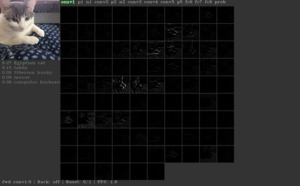
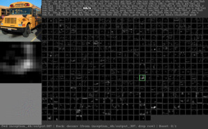

# Deep Visualization Toolbox

This is the code required to run the Deep Visualization Toolbox, as well as to generate the neuron-by-neuron visualizations using regularized optimization.
The toolbox and methods are described casually [here](http://yosinski.com/deepvis) and more formally in this paper:

 * Jason Yosinski, Jeff Clune, Anh Nguyen, Thomas Fuchs, and Hod Lipson. [Understanding neural networks through deep visualization](http://arxiv.org/abs/1506.06579). Presented at the Deep Learning Workshop, International Conference on Machine Learning (ICML), 2015.

If you find this paper or code useful, we encourage you to cite the paper. BibTeX:

    @inproceedings{yosinski-2015-ICML-DL-understanding-neural-networks,
    Author = {Jason Yosinski and Jeff Clune and Anh Nguyen and Thomas Fuchs and Hod Lipson},
    Booktitle = {Deep Learning Workshop, International Conference on Machine Learning (ICML)},
    Title = {Understanding Neural Networks Through Deep Visualization},
    Year = {2015}}

# Features

The main toolbox window looks like this, here showing a convolutional unit that responds to automobile wheels:

For a quick tour of the toolbox features, including what each pane of the above interface is showing, watch this [4 min YouTube video](https://www.youtube.com/watch?v=AgkfIQ4IGaM). In addition to processing images files from disk, the toolbox can run off a webcam for live network visualization **(below left)**.
The toolbox comes bundled with the default [caffenet-yos](models/caffenet-yos) model weights and pre-computed per-unit visualizations shown in the paper. Weights, but not per-unit visualizations, for [bvlc-googlenet](models/bvlc-googlenet) **(below right)** and [squeezenet](models/squeezenet) can be downloaded by scripts in their respective directories.

You can visualize your own model as well. However, note that the toolbox provides two rather separate sets of features; the first is easy to use with your own model, and the second is more involved:

1. **Forward/backward prop**: Images can be run forward through the network to visualize activations, and derivatives of any unit with respect to any other unit can be computed using backprop. In addition to traditional backprop, deconv from [Zeiler and Fergus (2014)](https://scholar.google.com/scholar?q=Zeiler+Visualizing+and+understanding+convolutional+networks) is supported as a way of flowing information backwards through the network. Doing forward and backward passes works for any model that can be run in Caffe (including yours!).

2. **Per-unit visualizations**: Three types of per-unit visualizations can be computed for a network &mdash; max image, deconv of max image, activation maximization via regularized optimization &mdash; but these visualizations must be computed *outside* the toolbox and saved as jpg. The toolbox then loads these jpgs to display alongside units as they are selected. Visualizations must be pre-computed because they are far too expensive to run live. For example, going through the 1.3m image training set to find the images causing top-9 activations took 40 hours on our system (for all units). Per-unit visualization jpgs are provided for the caffenet-yos model, but not for the bvlc-googlenet or squeezenet models (and not for yours, but you can [compute them yourself](doc/computing_per_unit_visualizations.md)).

Summary:

| Model          | Forward/Backward prop | Per-unit visualizations |
| -------------  | ---------------- | ----------------------- |
| [caffenet-yos](models/caffenet-yos) | **easy**             | **included**            |
| [bvlc-googlenet](bvlc-googlenet)    | **easy**             | not-included, [generate](doc/computing_per_unit_visualizations.md) if desired            |
| [squeezenet](models/squeezenet)     | **easy**             | not-included, [generate](doc/computing_per_unit_visualizations.md) if desired            |
| your network | **easy** (just point to your model in `settings_local.py`)  | not-included, [generate](doc/computing_per_unit_visualizations.md) if desired  |

# Setting up and running the toolbox

### Step 0: Compile master branch of caffe (optional but recommended)

Checkout the master branch of [Caffe](http://caffe.berkeleyvision.org/) and compile it on your
machine. If you've never used Caffe before, it can take a bit of time to get all the required libraries in place. Fortunately, the [installation process is well documented](http://caffe.berkeleyvision.org/installation.html). When you're installing the OpenCV dependency, install the Python bindings as well (see Step 2 below).

Note: When compiling Caffe, you can set `CPU_ONLY := 1` in your `Makefile.config` to skip all the Cuda/GPU stuff. The Deep Visualization Toolbox can run with Caffe in either CPU or GPU mode, and it's simpler to get Caffe to compile for the first time in `CPU_ONLY` mode. If Caffe is compiled with GPU options enabled, CPU vs. GPU may be switched at runtime via a setting in `settings_local.py`. Also, cuDNN may be enabled or disabled by recompiling Caffe with or without cuDNN.

### Step 1: Compile the deconv-deep-vis-toolbox branch of caffe

Instead of using the master branch of Caffe, to use the demo
you'll need the slightly modified [deconv-deep-vis-toolbox Caffe branch](https://github.com/yosinski/caffe/tree/deconv-deep-vis-toolbox) (supporting deconv and a few
extra Python bindings). Getting the branch and switching to it is easy.
Starting from your Caffe directory (that is, the directory where you've checked out Caffe, *not* the directory where you've checked out the DeepVis Toolbox), run:

    $ git remote add yosinski https://github.com/yosinski/caffe.git
    $ git fetch --all
    $ git checkout --track -b deconv-deep-vis-toolbox yosinski/deconv-deep-vis-toolbox
    $ < edit Makefile.config to suit your system if not already done in Step 0 >
    $ make clean
    $ make -j
    $ make -j pycaffe

As noted above, feel free to compile in `CPU_ONLY` mode.

### Step 2: Install prerequisites

The only prerequisites beyond those required for Caffe are `python-opencv`, `scipy`, and `scikit-image`, which may be installed as follows (other install options exist as well):

#### Ubuntu:

    $ sudo apt-get install python-opencv scipy python-skimage

#### Mac using [homebrew](http://brew.sh/):

Install `python-opencv` using one of the following two lines, depending on whether you want to compile using Intel TBB to enable parallel operations:

    $ brew install opencv
    $ brew install --with-tbb opencv

Install `scipy` either with OpenBLAS...

    $ brew install openblas
    $ brew install --with-openblas scipy

...or without it

    $ brew install scipy

And install `scikit-image` using pip:

    $ pip install scikit-image

You may have already installed the `python-opencv` bindings as part of the Caffe setup process. If `import cv2` works from Python, then you're all set. Similarly for `import scipy` and `import skimage`.

### Step 3: Download and configure Deep Visualization Toolbox code

You can put it wherever you like:

    $ git clone https://github.com/yosinski/deep-visualization-toolbox
    $ cd deep-visualization-toolbox

The settings in the latest version of the toolbox (February 2016) work a bit differently than in earlier versions (April 2015). If you have the latest version (recommended!), 
the minimal steps are to create a `settings_local.py` file using the template for the default `caffenet-yos` model:

    $ cp models/caffenet-yos/settings_local.template-caffenet-yos.py settings_local.py

And then edit the `settings_local.py` file to make the `caffevis_caffe_root` variable point to the directory where you've compiled caffe in Step 1:

    $ < edit settings_local.py >

*Note on settings:* Settings are now split into two files: a versioned `settings.py` file that provides documentation and default values for all settings and an unversioned `settings_local.py` file. This latter file allows you to override any default setting to tailor the toolbox to your specific setup (Caffe path, CPU vs. GPU, webcam device, etc) and model (model weights, prototxt, sizes of the various panels shown in the toolbox, etc). This also makes it easy to distribute settings tweaks alongside models: for example, `models/bvlc-googlenet/settings_local.template-bvlc-googlenet.py` includes the appropriate window pane sizes and so on for the `bvlc-googlenet` model. To load a new model, just change the details in `settings_local.py`, perhaps by copying from the included template.

Finally, download the default model weights and corresponding top-9 visualizations saved as jpg (downloads a 230MB model and 1.1GB of jpgs to show as visualization):

    $ cd models/caffenet-yos/
    $ ./fetch.sh
    $ cd ../..

### Step 4: Run it!

Simple:

    $ ./run_toolbox.py

Once the toolbox is running, push 'h' to show a help screen. You can also have a look at `bindings.py` to see what the various keys do. If the window is too large or too small for your screen, set the `global_scale` and `global_font_size` variables in `settings_local.py` to values smaller or larger than 1.0.

# Troubleshooting

If you have any problems running the Deep Vis Toolbox, here are a few things to try:

 * Make sure you can compile the master branch of Caffe (Step 0 above)! If you can't, see the [detailed compilation instructions for Caffe](http://caffe.berkeleyvision.org/installation.html). If you encounter issues, the [caffe-users](https://groups.google.com/forum/#!forum/caffe-users) mailing list is a good place to look for solutions others have found.
 * Try using the `dev` branch of this toolbox instead of `master` (`git checkout dev`). Sometimes it's a little more up to date.
 * If you get an error (`AttributeError: 'Classifier' object has no attribute 'backward_from_layer'`) when switching to backprop or deconv modes, it's because your compiled branch of Caffe does not have the necessary Python bindings for backprop/deconv. Follow the directions in "Step 1: Compile the deconv-deep-vis-toolbox branch of caffe" above.
 * If the backprop pane in the lower left is just gray, it's probably because backprop and deconv are producing all zeros. By default, Caffe won't compute derivatives at the data layer, because they're not needed to update parameters. The fix is simple: just add `force_backward: true` to your network prototxt, [like this](https://github.com/yosinski/deep-visualization-toolbox/blob/master/models/caffenet-yos/caffenet-yos-deploy.prototxt#L7).
 * If the toolbox runs but the keys don't respond as expected, this may be because keys behave differently on different platforms. Run the `test_keys.py` script to test behavior on your system.
 * If none of that helps, feel free to [email me](http://yosinski.com/) or [submit an issue](https://github.com/yosinski/deep-visualization-toolbox/issues). I might have left out an important detail here or there :).

# Other ways of running the toolbox

If running the toolbox on a local Mac or Linux machine isn't working for you, you might want to try one of these other options:

 * John Moeller has put together a [Docker container for the toolbox](https://github.com/fishcorn/dvtb-container). This should even work on Windows! (confirmation needed)

 * If you're desperate, it's also possible to [run the toolbox on Amazon EC2](doc/deep-vis-on-aws.md), but display will be much slower and images can be loaded only from file (not from webcam).

